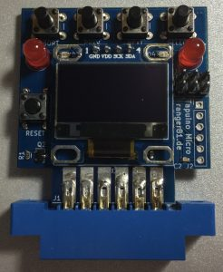

# Tapunio micro
The Tapuino micro is a hardware implementation of the [Tapuino project](https://github.com/sweetlilmre/tapuino).

The original firmware was adjusted to work with the hardware from www.64kb.de. Please check the following page for more information: https://64kb.de/tapuino-micro/. Additionally, the firmware was ported to a PlatformIO project.

## Credits
Please also check the README.md file within the src folder for credits to the initial developers of this project.